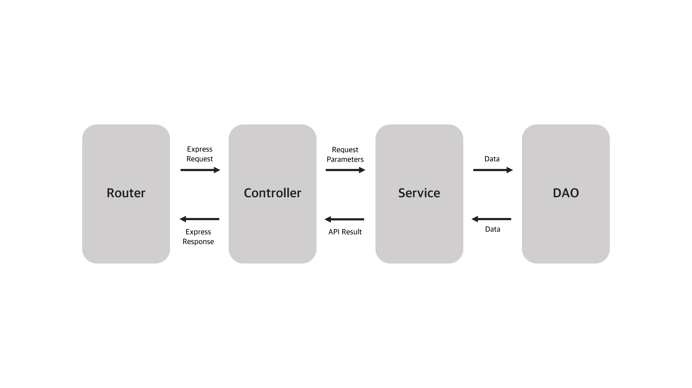

# Share Space Back-end Server

Back-end server for the Share Space project.

## Used Programs

* Node.js
* TypeScript
* Express
* MySQL

## Web API

[API Document](doc/API.md)

## Configuration

[Config Document](doc/Config.md)

## Structure

